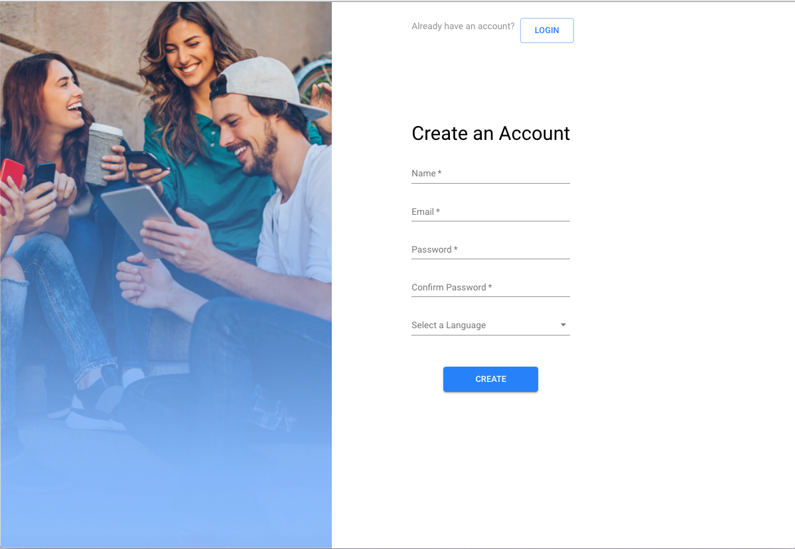
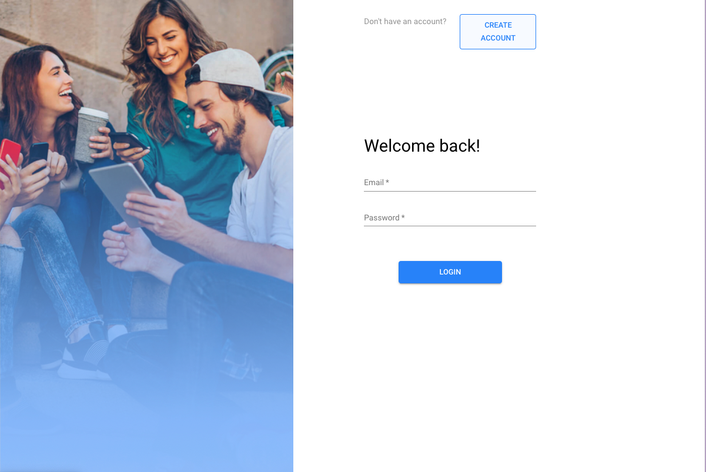
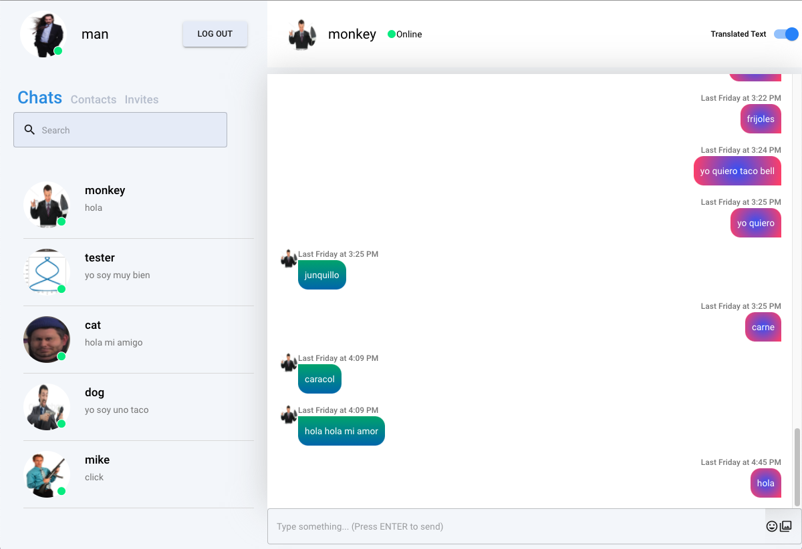
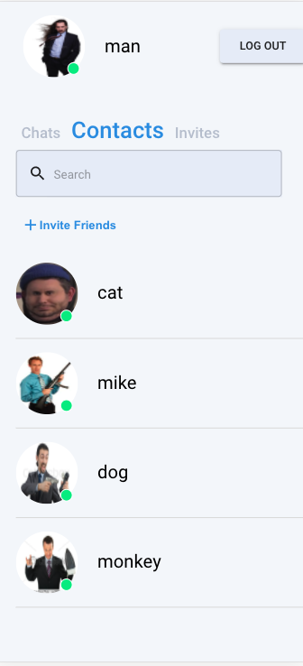
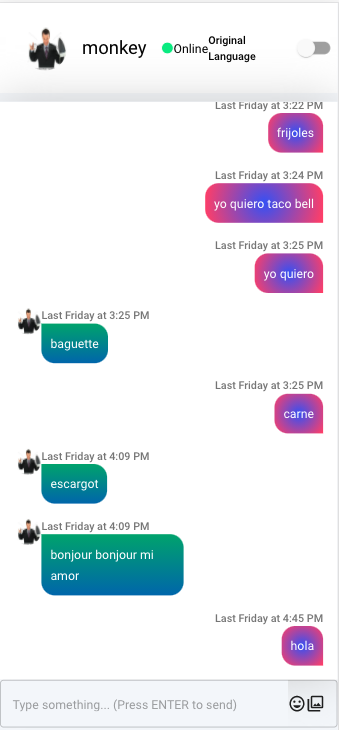

# World Chat

World Chat is a unique messenger app that allows different users to live chat and translate their messages on the fly. Language should be no barrier to internet communication!

Create a new account or login with the credentials below:
email: man@aol.com
password: 123456

## Abstract

Each user has a primary language key attached to their profile. If two users enter a chat together, a comparison is made between each of their primary languages. If primary languages are different, each message sent is stored in its original language, and a translated form adapted to the other user's primary language.

### Example

User A has a primary language of **Spanish**
User B has a primary language of **French**

- User A says "Hola".
- User B receives "Hola" but can toggle a switch to see "Bonjour".

Each user has a list of contacts, current chats, and list of friend requests incoming and pending friend requests outgoing.

Users may invite friends to the platform via email that we've implemented using **SendGrid**.

## Installation

Fork and clone this repository

### Back-end

`//in root directory`
`npm install`
`nodemon`

### Front-end

`cd client`
`npm install`
`npm start`

## Media

### Register

### Login

### Chat Interface Original Language

### Chat Interface Translation Active

### Mobile Sidebar

### Mobile Chat

### Dependencies

google-cloud/translate
sendgrid/mail
aws-sdk
bcrypt
body-parser
concurrently
cookie-parser
cors
debug
dotenv
express
express-validator
http-errors
jsonwebtoken
mongoose
morgan
multer
nodemon
socket.io
uuid
material-ui/core
material-ui/icons
material-ui/lab
material-ui/styles
axios
email-validator
js-cookie
moment
react
react-copy-to-clipboard
react-debounce-input
react-dom
react-router-dom
react-scripts
socket.io-client

### Acknowledgements

Thank you to Bonnie and Carmen of Hatchways for their assistance, mentorship, and code reviews which have improved this project and in turn, made us better developers.
